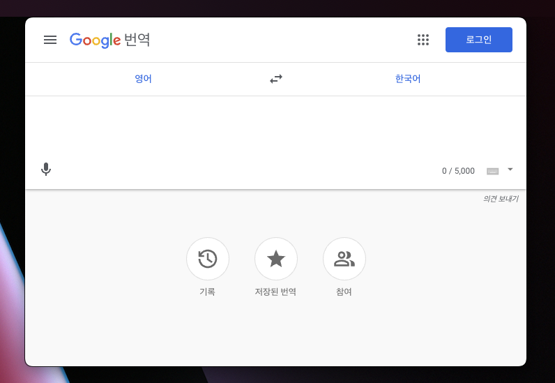

# kk-translator




단축키로 빠르게 번역기를 실행할 수 있습니다. 

- Only MAC OS

## 빌드하기


- 아래 명령어로 소스를 빌드합니다.
- 빌드 환경에 따라 x64 또는 arm64 에 호환되는 패키지가 생성됩니다.
- 빌드 결과물인 .dmg 파일을 실행하여 설치합니다.
```
$ yarn install
$ yarn make
$ cd ./out/make
$ open .
```

## 단축키


- 애플리케이션 창 열기/닫기 : command + control + arrow up
- 애플리케이션 종료 : command + q